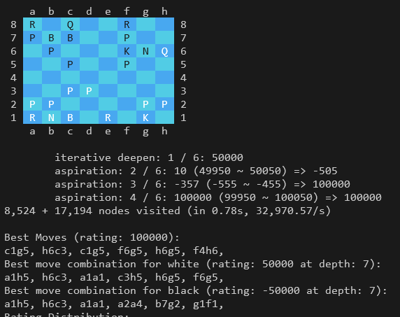
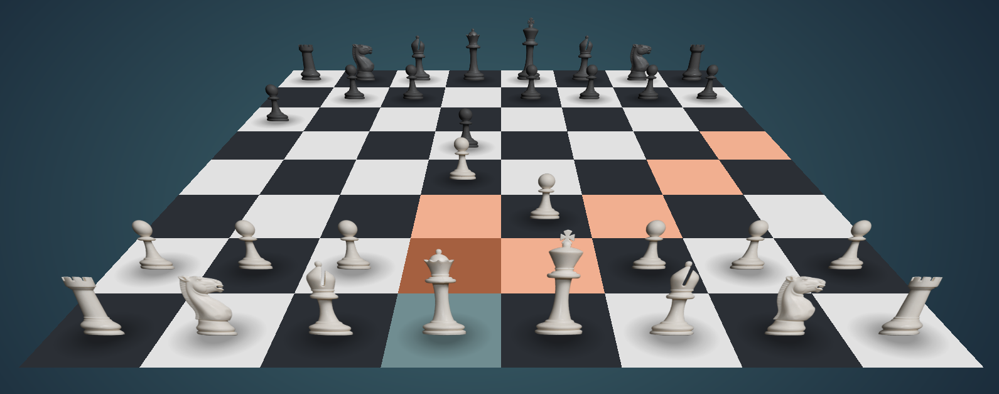

# Blunder

## A Simple Chess Engine written in C++

- Minimax-Algorithm with Alpha-Beta-Pruning
- Quiescence Search
- Move Ordering (MVV/LVA)
- Iterative Deepening with Aspiration Windows
- HTTP API via crow with sample 3D-Web-UI
- Command Line based UI

<a></a>
<br>
<a></a>
<br>

### How to build the project:
```bat
create_project.bat
MSBuild /p:Configuration=Release /nologo /v:m
```
